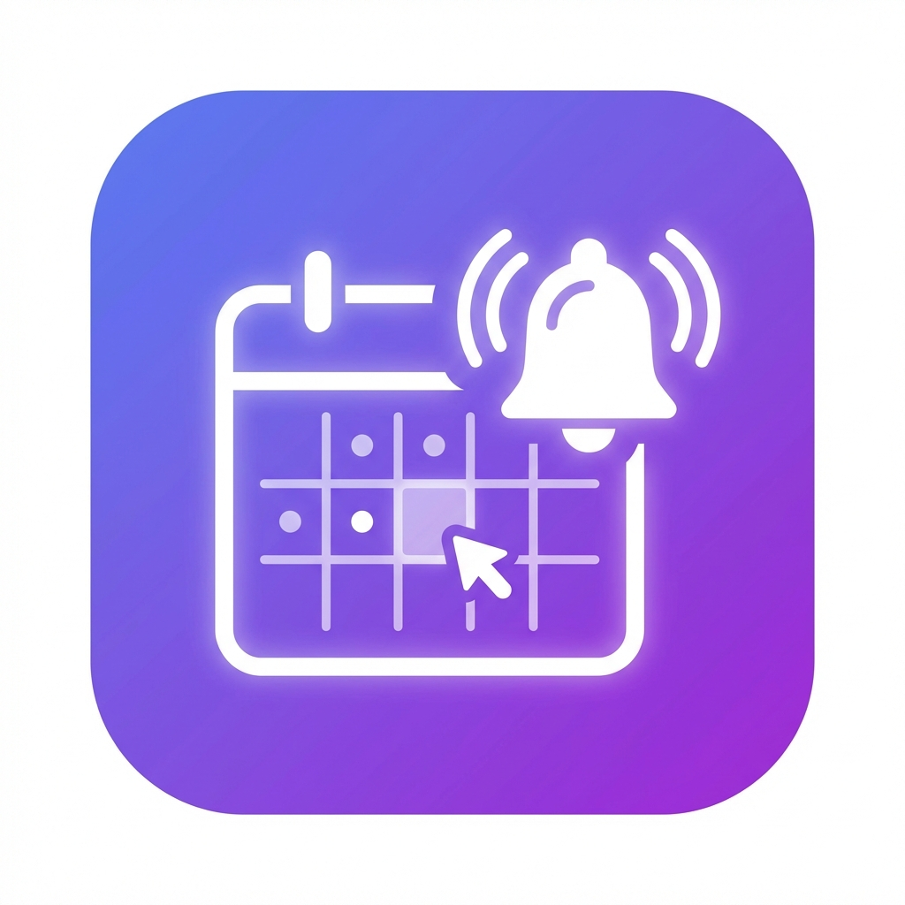

# התראות מערכת שעות - תיכון בגין
# Schedule Notifier - Begin High School

<div align="center">



**קבל התראות אוטומטיות על שינויים במערכת השעות שלך**

**Get automatic notifications about changes to your class schedule**

[עברית](#עברית) | [English](#english)

</div>

---

## עברית

### תיאור
אפליקציית PWA (Progressive Web App) שבודקת אוטומטית שינויים במערכת השעות של תיכון בגין ושולחת התראות Push לטלפון שלך כאשר שיעור מבוטל או עובר לחדר אחר.

### תכונות
- ✅ בחירת כיתה וסינון מורים אישי
- ✅ התראות Push אוטומטיות (גם כשהאפליקציה סגורה!)
- ✅ בדיקה כל 20 דקות
- ✅ תמיכה בעברית ואנגלית
- ✅ ממשק מודרני וידידותי
- ✅ התקנה למסך הבית (כמו אפליקציה רגילה)

### התקנה

#### שלב 1: הגדרת Firebase
1. היכנס ל-[Firebase Console](https://console.firebase.google.com/)
2. צור פרויקט חדש
3. הוסף אפליקציית Web לפרויקט
4. העתק את פרטי ההגדרה (API Key, Project ID, וכו')
5. ב-Cloud Messaging, צור Web Push Certificate (VAPID Key)
6. הורד את Service Account Key (JSON) מ-Settings > Service Accounts

#### שלב 2: הגדרת Backend
```bash
cd backend

# התקן Python dependencies
pip install -r requirements.txt

# העתק את קובץ ההגדרות
copy .env.example .env

# ערוך את .env והכנס את נתיב ה-Firebase credentials
# FIREBASE_CREDENTIALS_PATH=path/to/serviceAccountKey.json

# העתק את קובץ ה-Service Account JSON לתיקיית backend
copy path/to/serviceAccountKey.json firebase-credentials.json
```

#### שלב 3: הגדרת Frontend
```bash
cd frontend

# התקן dependencies
npm install

# העתק את קובץ ההגדרות
copy .env.example .env

# ערוך את .env והכנס את פרטי Firebase שלך
```

ערוך את `frontend/.env`:
```env
VITE_FIREBASE_API_KEY=your_api_key
VITE_FIREBASE_AUTH_DOMAIN=your_project.firebaseapp.com
VITE_FIREBASE_PROJECT_ID=your_project_id
VITE_FIREBASE_STORAGE_BUCKET=your_project.appspot.com
VITE_FIREBASE_MESSAGING_SENDER_ID=your_sender_id
VITE_FIREBASE_APP_ID=your_app_id
VITE_FIREBASE_VAPID_KEY=your_vapid_key
VITE_API_URL=http://localhost:5000/api
```

ערוך גם את `frontend/public/firebase-messaging-sw.js` עם אותם פרטים.

#### שלב 4: הרצה מקומית (לבדיקה)
```bash
# טרמינל 1 - Backend
cd backend
python api.py

# טרמינל 2 - Frontend
cd frontend
npm run dev
```

פתח את הדפדפן ב-`http://localhost:3000`

#### שלב 5: פריסה לענן (חינם!)

**Backend - Render.com:**
1. צור חשבון ב-[Render.com](https://render.com)
2. לחץ "New +" > "Web Service"
3. חבר את ה-GitHub repository שלך
4. הגדרות:
   - **Build Command:** `pip install -r requirements.txt`
   - **Start Command:** `python api.py`
   - **Environment Variables:** הוסף את המשתנים מ-`.env`
5. העלה את `firebase-credentials.json` דרך Render Dashboard

**Frontend - Vercel/Netlify:**
1. צור חשבון ב-[Vercel](https://vercel.com) או [Netlify](https://netlify.com)
2. חבר את ה-repository
3. הגדר את Environment Variables מ-`.env`
4. פרוס!

עדכן את `VITE_API_URL` ב-frontend ל-URL של ה-Backend שפרסת.

### שימוש
1. פתח את האפליקציה בדפדפן
2. בחר את הכיתה שלך (למשל: י''ב 4)
3. בחר את המורים שלך בכל מקצוע
4. אפשר התראות Push
5. זהו! תקבל התראות אוטומטיות על שינויים

**התקנה למסך הבית:**
- **Android Chrome:** לחץ על תפריט (⋮) > "הוסף למסך הבית"
- **iOS Safari:** לחץ על שתף > "הוסף למסך הבית"

---

## English

### Description
A Progressive Web App (PWA) that automatically checks for changes in Begin High School's schedule and sends push notifications to your phone when a class is cancelled or moved to a different room.

### Features
- ✅ Class selection and personal teacher filtering
- ✅ Automatic Push notifications (even when app is closed!)
- ✅ Checks every 20 minutes
- ✅ Hebrew and English support
- ✅ Modern, user-friendly interface
- ✅ Install to home screen (like a native app)

### Installation

#### Step 1: Firebase Setup
1. Go to [Firebase Console](https://console.firebase.google.com/)
2. Create a new project
3. Add a Web app to the project
4. Copy the configuration details (API Key, Project ID, etc.)
5. In Cloud Messaging, create a Web Push Certificate (VAPID Key)
6. Download the Service Account Key (JSON) from Settings > Service Accounts

#### Step 2: Backend Setup
```bash
cd backend

# Install Python dependencies
pip install -r requirements.txt

# Copy environment file
copy .env.example .env

# Edit .env and add your Firebase credentials path
# FIREBASE_CREDENTIALS_PATH=path/to/serviceAccountKey.json

# Copy the Service Account JSON to backend folder
copy path/to/serviceAccountKey.json firebase-credentials.json
```

#### Step 3: Frontend Setup
```bash
cd frontend

# Install dependencies
npm install

# Copy environment file
copy .env.example .env

# Edit .env and add your Firebase details
```

Edit `frontend/.env`:
```env
VITE_FIREBASE_API_KEY=your_api_key
VITE_FIREBASE_AUTH_DOMAIN=your_project.firebaseapp.com
VITE_FIREBASE_PROJECT_ID=your_project_id
VITE_FIREBASE_STORAGE_BUCKET=your_project.appspot.com
VITE_FIREBASE_MESSAGING_SENDER_ID=your_sender_id
VITE_FIREBASE_APP_ID=your_app_id
VITE_FIREBASE_VAPID_KEY=your_vapid_key
VITE_API_URL=http://localhost:5000/api
```

Also edit `frontend/public/firebase-messaging-sw.js` with the same details.

#### Step 4: Run Locally (for testing)
```bash
# Terminal 1 - Backend
cd backend
python api.py

# Terminal 2 - Frontend
cd frontend
npm run dev
```

Open browser at `http://localhost:3000`

#### Step 5: Deploy to Cloud (Free!)

**Backend - Render.com:**
1. Create account at [Render.com](https://render.com)
2. Click "New +" > "Web Service"
3. Connect your GitHub repository
4. Settings:
   - **Build Command:** `pip install -r requirements.txt`
   - **Start Command:** `python api.py`
   - **Environment Variables:** Add variables from `.env`
5. Upload `firebase-credentials.json` via Render Dashboard

**Frontend - Vercel/Netlify:**
1. Create account at [Vercel](https://vercel.com) or [Netlify](https://netlify.com)
2. Connect repository
3. Set Environment Variables from `.env`
4. Deploy!

Update `VITE_API_URL` in frontend to your deployed Backend URL.

### Usage
1. Open the app in your browser
2. Select your class (e.g., י''ב 4)
3. Select your teachers for each subject
4. Enable push notifications
5. Done! You'll receive automatic notifications about changes

**Install to Home Screen:**
- **Android Chrome:** Tap menu (⋮) > "Add to Home screen"
- **iOS Safari:** Tap share > "Add to Home Screen"

---

## Project Structure
```
schedule-notifier/
├── backend/
│   ├── api.py              # Flask REST API
│   ├── scraper.py          # Website scraper
│   ├── database.py         # SQLite database
│   ├── notifier.py         # Firebase notifications
│   ├── scheduler.py        # Background scheduler
│   └── requirements.txt    # Python dependencies
├── frontend/
│   ├── src/
│   │   ├── components/     # UI components
│   │   ├── services/       # API & notifications
│   │   ├── i18n/          # Translations
│   │   └── main.js        # App entry point
│   ├── public/            # Static assets
│   └── package.json       # Node dependencies
└── README.md
```

## Technologies Used
- **Backend:** Python, Flask, BeautifulSoup, APScheduler, Firebase Admin SDK
- **Frontend:** Vanilla JavaScript, Vite, Firebase SDK
- **Database:** SQLite
- **Notifications:** Firebase Cloud Messaging (FCM)

## Support
For issues or questions, please open an issue on GitHub.

## License
MIT License - Feel free to use and modify!

---

Made with ❤️ for Begin High School students
